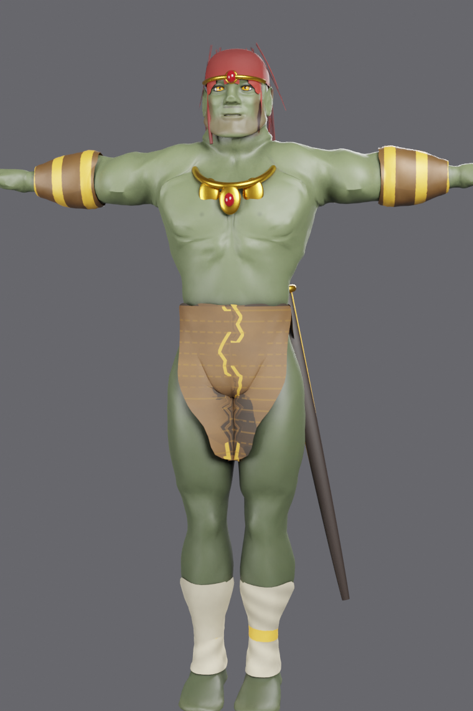

# Ganondorf — Second Life Bento Avatar

A complete, upload-ready **Bento avatar of Ganondorf** (Tears of the
Kingdom design) for Second Life, plus the fully automated Blender pipeline
that builds it from the official Linden Lab avatar assets.



## What you get

**14 attachments**, each a separate wearable mesh with custom LOD chains:

| Attachment | Rigging |
|---|---|
| Body (+ eyes + eyelashes) | full Bento: fitted-mesh volumes, 30 finger bones, 30 face bones |
| Hair (mane + topknot + sideburns) | head/neck |
| Circlet with forehead gem | head |
| Earrings | head |
| Necklace (collar + plates + gem) | chest/neck |
| Robe (open, gold-trimmed) | body weights (cut from the body itself) |
| Sash / obi | body weights |
| Pants | body weights |
| Bracers (L/R separate) | body weights |
| Leg wraps + anklets (L/R separate) | body weights |
| Sword + sheath | static attachment (Left Hip) |

Plus **18 textures** (green Gerudo skin on the standard SLUV layout with
baked musculature shading, amber eyes, hair, fabrics with normal maps,
metals) and full docs.

- `output/dae/` — 53 Collada files (high LOD + `_LOD2/_LOD1/_LOD0` +
  shared physics), validated against SL's upload rules
- `output/textures/` — upload-ready PNGs
- `output/preview/` — turntable/pose/beauty renders
- `docs/UPLOAD_GUIDE.md` — **step-by-step upload & assembly instructions**
- `docs/RESEARCH.md` — the research behind every design decision

## Design highlights

- **Bakes-on-Mesh single-layer body** (modern Slink-Redux architecture,
  not Legacy-style onion layers): standard SLUV texture coordinates mean
  any BoM skin, tattoo, system clothing and alpha wearables work.
- **Viewer-exact foundation**: geometry/UVs/weights/morph targets parsed
  from the official `.llm` avatar binaries; skeleton built from
  `avatar_skeleton.xml` (133 bones + 26 collision volumes).
- **Appearance sliders work**: fitted-mesh collision-volume weights across
  the body (belly/butt/pec/handle zones get extra physics response);
  no joint offsets anywhere — height comes from the shape recipe.
- **Ganondorf physique** baked from official morph targets (muscular,
  male) + procedural sculpting (Gerudo shoulders, brow, jaw, pointed ears).
- **Garments cut from the body mesh** — identical fit, weights, and UVs by
  construction (the same reason commercial clothes fit exactly one body).
- Every DAE checked by `pipeline/validate_dae.py`: material/triangle/
  joint/weight limits, skeleton-exact inverse bind matrices, LOD naming.

## Rebuilding from source

Requirements: Blender 3.6 LTS (Collada exporter), python3 + numpy + Pillow.

```sh
pip install numpy pillow
BLENDER=/path/to/blender-3.6/blender pipeline/run_all.sh
```

Stages (each runnable standalone): `build_body.py` → `build_outfit.py` →
`bake_maps.py` → `textures.py` → `export_dae.py` → `validate_dae.py` →
`preview_textured.py`. See `pipeline/slkit/` for the library modules.

## Licensing note

`assets/sl_resources/` contains Linden Lab avatar definition files from the
open-source Second Life viewer (LGPL) — used here as the foundation for SL
content creation, which is their intended purpose. Ganondorf is a Nintendo
character; this avatar is a fan work for personal use in Second Life.
